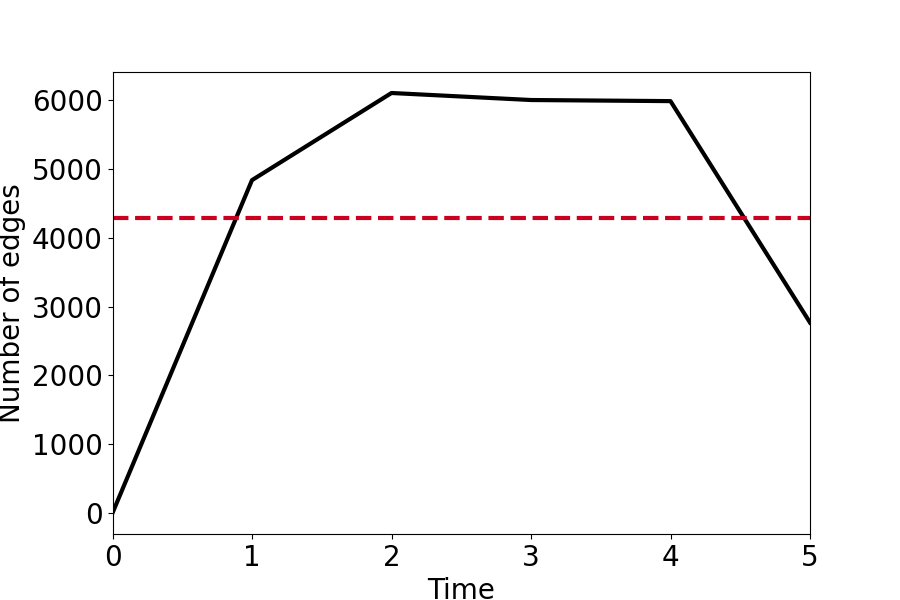

# TGBL-Wiki Link Prediction

Combined heuristic implementation on TGBL-Wiki dataset (graph ML project).

## Setup
1. Download dataset: [TGBL-Wiki](https://ogb.stanford.edu/docs/linkprop/#ogbn-arxiv) → Extract to `datasets/tgbl-wiki/`.
2. Run `TGBL_WIKI_ImplementaionOfACombinedHeuristic.ipynb`.

## Results
- See detailed report: [Readme.pdf](./Readme.pdf)
- Plots: [tgbl-wiki_edges_per_ts.png](./tgbl-wiki_edges_per_ts.png) etc.
- Methods: TEA [tgbl-wiki_TEA.pdf](./tgbl-wiki_TEA.pdf), TET [tgbl-wiki_TET.pdf](./tgbl-wiki_TET.pdf)

